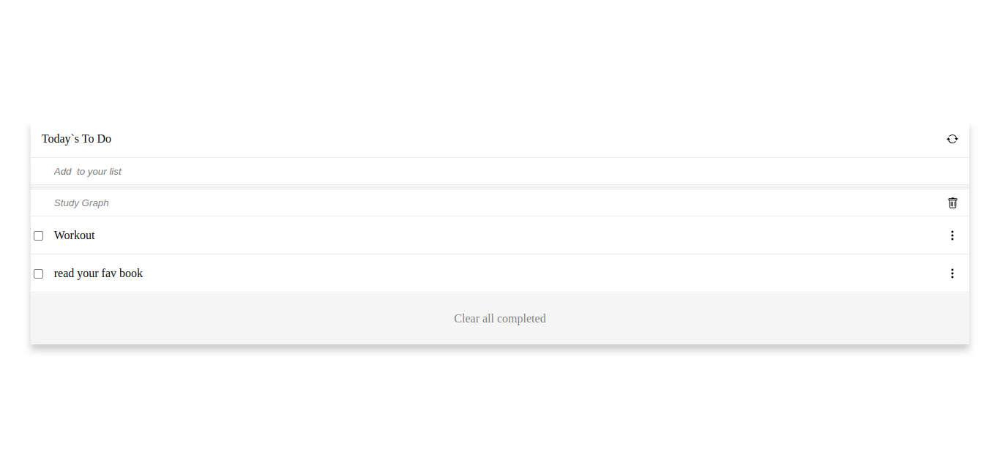

# To DO list

> Is a website to manage daily tasks

## Built With

- HTML,CSS,JS
- webpack

## Live Demo (if available)

[Live Demo Link](https://yosefhesham.github.io/todo-list/dist)

## Getting Started

**This is an example of how you may give instructions on setting up your project locally.**
**Modify this file to match your project, remove sections that don't apply. For example: delete the testing section if the currect project doesn't require testing.**

To get a local copy up and running follow these simple example steps.

### Prerequisites
- node and npm installed

### Setup
- clone the repo.
- run npm i to install packages.

### Install
- run npm start

## Authors

👤 **yosefHesham**

- GitHub: [@yosefHesham](https://github.com/yosefHesham)
- LinkedIn:[yousef](https://www.linkedin.com/in/yousef-hesham-b132ba179/)

## Contributers

👤 **bizibPascal**
 - GitHub: [@bizip](https://github.com/bizip) 
 - Twitter: [@twitterhandle](https://twitter.com/BizimunguPasca9) 
 - LinkedIn: [LinkedIn](www.linkedin.com/in/bizimungu)

## 🤝 Contributing

Contributions, issues, and feature requests are welcome!

Feel free to check the [issues page](../../issues/).

## Show your support

Give a ⭐️ if you like this project!

## Acknowledgments

- Hat tip to anyone whose code was used
- Hat tip to my contributer [@bizip](https://github.com/bizip)
- Inspiration
- etc

## 📝 License

This project is [MIT](./MIT.md) licensed.